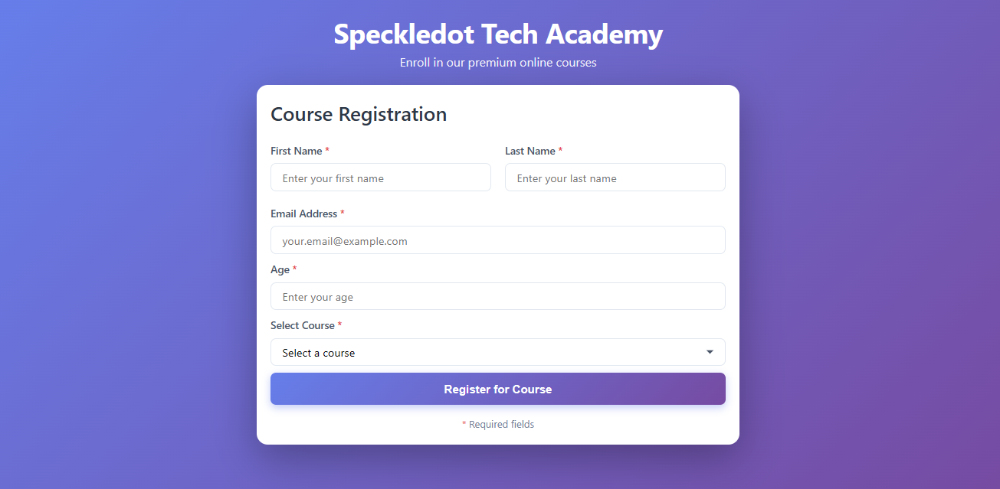
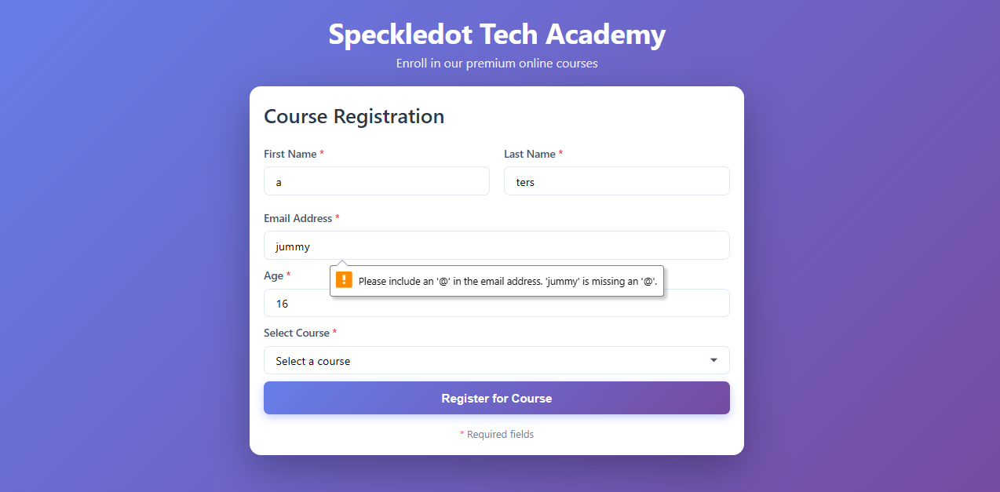
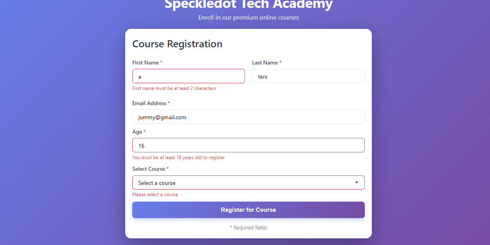
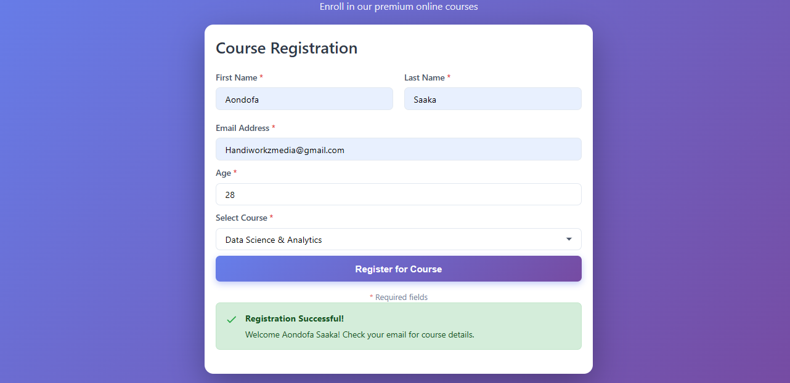

# Course Registration Form

A React TypeScript controlled component application for course registration with form validation.

## 🎓 Key Learnings

### 1. **useState for Form State Management**

Learned how to manage multiple form inputs using React's `useState` hook.

### 2. **Form Validation Patterns**

Learned how to implement comprehensive validation logic including regex patterns for email validation, numeric range checks, and conditional error handling.

### 3. **Event Handling in React**

Mastered React event handlers including `onChange` for real-time updates, `onSubmit` for form submission with `preventDefault()`, and managing error state clearing based on user interactions.

## 📸 Screenshots

### Registration Form


Default Form

### Validation Errors





### Success Message



## 🚀 Features

-   **Form Fields**: First Name, Last Name, Email, Age, and Course Selection
-   **Real-time Validation**: Input validation with error messages
-   **Success Feedback**: Confirmation message on successful registration
-   **Responsive Design**: Modern UI with gradient styling
-   **TypeScript**: Type-safe form handling

## 🎨 Styling

The project uses vanilla CSS with:

-   Gradient backgrounds
-   Responsive grid layouts
-   Form input states (focus, error)
-   Smooth transitions and hover effects

## 📝 Usage

1. Fill in all required fields
2. Errors will display on form submission if validation fails
3. Success message appears when all validations pass
4. Form auto-clears after 5 seconds on success

## 🧪 Testing the Application

### 📋 Prerequisites

-   Node.js (v20 or higher)
-   npm or yarn

### Clone and Run

```bash
# Clone the repository
git clone https://github.com/StivinTaesoo/course-registration-form

# Navigate to project directory
cd course-registration-form

# Install dependencies
npm install

# Start development server
npm run dev
```

The app will open at `http://localhost:5173`

### Test Cases to Try

**Valid Submission:**

-   First Name: `Tersoo`
-   Last Name: `Steve`
-   Email: `steve123@example.com`
-   Age: `25`
-   Course: Select any course
-   Click "Register for Course" ✅

**Test Validation Errors:**

-   Leave fields empty and submit
-   Enter age less than 18 (e.g., `17`)
-   Enter invalid email (e.g., `invalid-email`)
-   Enter names with less than 2 characters
-   Try submitting without selecting a course

**Test Real-time Error Clearing:**

-   Submit form with errors
-   Start typing in any field with an error
-   Notice the error message disappears as you type

## 🔧 Technologies Used

-   React 18
-   TypeScript
-   Vite
-   CSS3

## 📄 License

MIT

---

Copyright &copy; Stephen Tersoo @ eHA Academy 2025

Built with ❤️ using React and TypeScript
